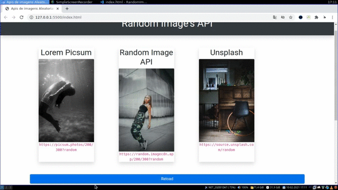

<h1 align="center">Random Image's API</h1>

APis de imagens aleatórias

APIS de imagens aleatórias. Uma divertida alternativa para quando se está estruturando uma página e não sabe que imagem colocar para testar elementos como: Cards, Header, Jumbotron, entre outros.
 

<h3 align="center">Bibliotecas Utilizadas</h3>

  
    
      

<h3 align="center"> Aplicação em Funcionamento </h3>
 

 
 

